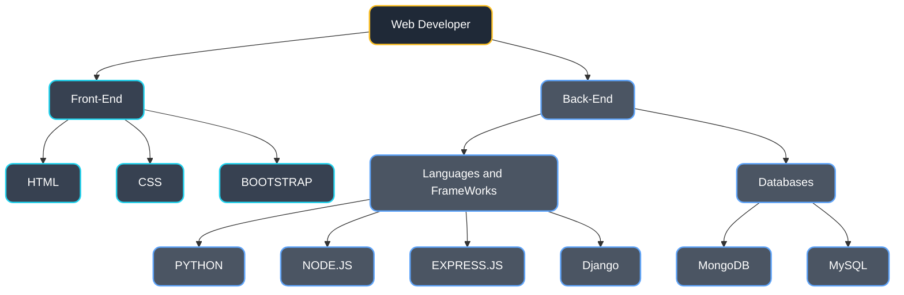

<h1 align="center">Hi, I'm Arshad VKB 👋</h1>
<h3 align="center">Python Enthusiast</h3>

<div align="center">


[](https://www.linkedin.com/in/arshadvkb)
[](mailto:arshadvkb969@gmail.com)


</div>

```typescript
class Developer {
    string name = "Arshad VKB";
    string role  = "Python Developer";
    string location  = "India,Kerala";
    List<String> learning  = ["Python","Node.js","MongoDB"];
    List<String> askMeAbout = ["Web Dev", "App Dev", "Python",];
}
```

## 💻 Technical Skills




## 🤝 Connect With Me

<div align="center">
    
[](https://www.linkedin.com/in/arshad-vkb-b860a0323?utm_source=share&utm_campaign=share_via&utm_content=profile&utm_medium=android_app)
[](https://www.instagram.com/arshadvkb)

[](https://arshadvkb.github.io/Arshadvkb/)


</div>


<div align="center">
  <i>Always learning, always growing. Feel free to reach out!</i>
</div>
